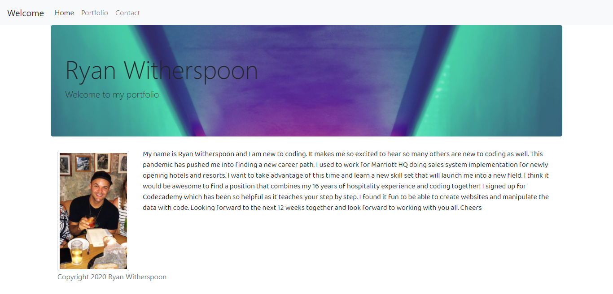

# homework_20_react_portfolio

#
For this assignment, we converted our portfolio to a REACT portfolio

## Installation

To use application simply click on Heroku Link below

## Usage

Not Applicable 

## Technologies Used

    ** NPM install:  
     "bootstrap": "^4.5.3",
    "react": "^17.0.1",
    "react-bootstrap": "^1.4.0",
    "react-dom": "^17.0.1",
    "react-router-dom": "^5.2.0",
    "react-scripts": "4.0.1",
    "web-vitals": "^0.2.4"

## Problems I faced

I had some isses with deploying to heroku

## Credits

Ryan Witherspoon

## Image

## Links
[Link to GitHub!](https://github.com/ryanwit/homework_20_react_portfolio)

[Link to Heroku!](https://warm-ravine-75423.herokuapp.com//)

